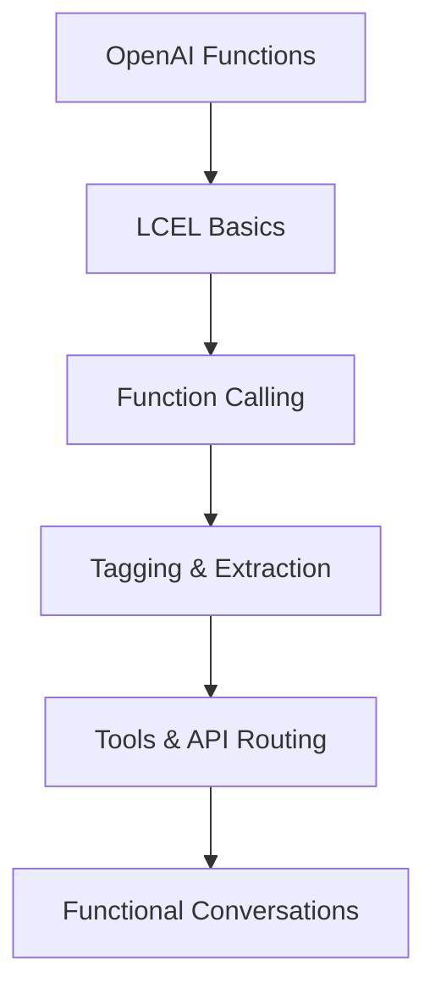

# ⚡ Functions, Tools & Agents with LangChain

A collection of **Jupyter notebooks** demonstrating core **LangChain** capabilities with a focus on **Functions, Tools, and Agents**. The goal is to make concepts **clear, practical, and reproducible**.

> 🎯 **Objective:** Learn LangChain’s core features through hands-on notebooks you can run, tweak, and reuse in your own projects.

---

## 📚 Lessons

Each notebook covers a specific capability:

1. **[L1-openai_functions.ipynb](./notebooks/L1-openai_functions.ipynb)**  
   Intro to **OpenAI Functions** and basic usage patterns

2. **[L2-LangChain_Expression_Language_LCEL.ipynb](./notebooks/L2-LangChain_Expression_Language_LCEL.ipynb)**  
   Understanding **LCEL (LangChain Expression Language)** with examples

3. **[L3-function-calling.ipynb](./notebooks/L3-function-calling.ipynb)**  
   **Function calling** in LangChain—patterns and best practices

4. **[L4-tagging-and-extraction.ipynb](./notebooks/L4-tagging-and-extraction.ipynb)**  
   Data **tagging** and **information extraction** techniques

5. **[L5-tools-routing-apis.ipynb](./notebooks/L5-tools-routing-apis.ipynb)**  
   **Tool** creation/management and **API routing** strategies

6. **[L6-functional_conversation.ipynb](./notebooks/L6-functional_conversation.ipynb)**  
   Building **functional conversation** flows and managing state

---

## 📊 Learning Workflow


🚀 Quick Start
```
# 1) Clone
git clone https://github.com/gorkenvm/Functions-Tools-and-Agents-with-LangChain.git
cd Functions-Tools-and-Agents-with-LangChain
# 2) (Recommended) Create a virtual environment
python -m venv .venv
source .venv/bin/activate   # Windows: .venv\Scripts\activate
# 3) Install dependencies
# Option A: use requirements.txt (see below)
# pip install -r requirements.txt
```

---
## 🛠️ Project Structure

```bash
Functions-Tools-and-Agents-with-LangChain/
│── notebooks/                 → Jupyter notebooks for each lesson
│   │── L1-openai_functions.ipynb
│   │── L2-LangChain_Expression_Language_LCEL.ipynb
│   │── L3-function-calling.ipynb
│   │── L4-tagging-and-extraction.ipynb
│   │── L5-tools-routing-apis.ipynb
│   │── L6-functional_conversation.ipynb
│── README.md                  → Project documentation
│── .env                  
│── requirements.txt

```

---

---

## 📖 Usage

- Open the desired notebook in the `notebooks/` folder.  
- Run cells step by step to explore functionality.  
- Modify and extend examples for your own projects.  

---
📖 Usage
•	Open any notebook and run cells top-to-bottom.
•	Replace prompts/parameters with your own use cases.
•	Extend examples to fit your application needs.
---

---
## 📚 Resources

- [DeepLearning.AI – Functions, Tools, and Agents with LangChain](https://learn.deeplearning.ai/courses/functions-tools-agents-langchain/lesson/4/openai-function-calling-in-langchain)  
- [LangChain Documentation](https://python.langchain.com/)  
- [OpenAI API Reference](https://platform.openai.com/docs/)  
---

## 🤝 Contributing

Contributions are welcome!  
Please fork the repo and submit a pull request, or open an issue if you encounter a problem.

